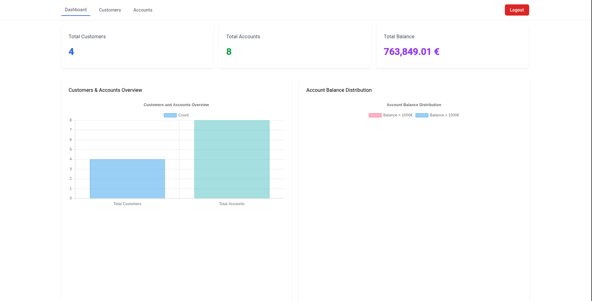
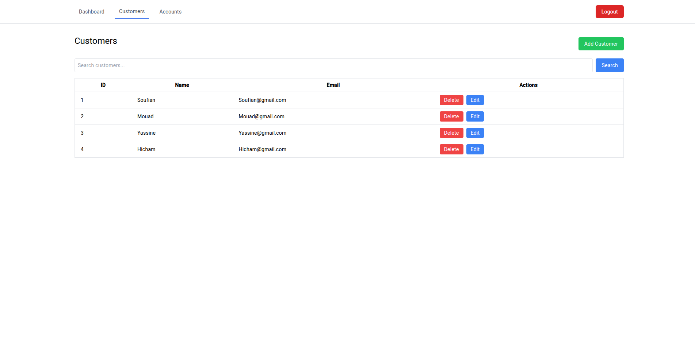
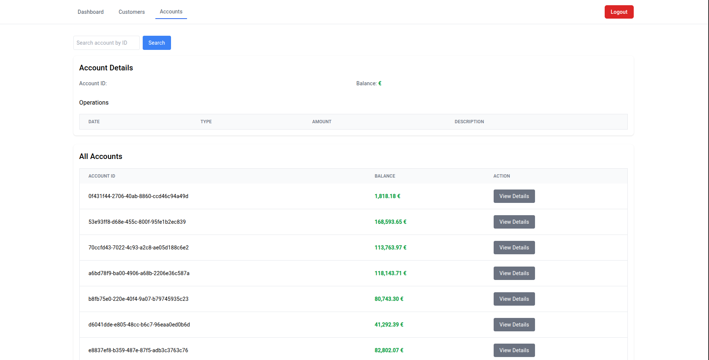
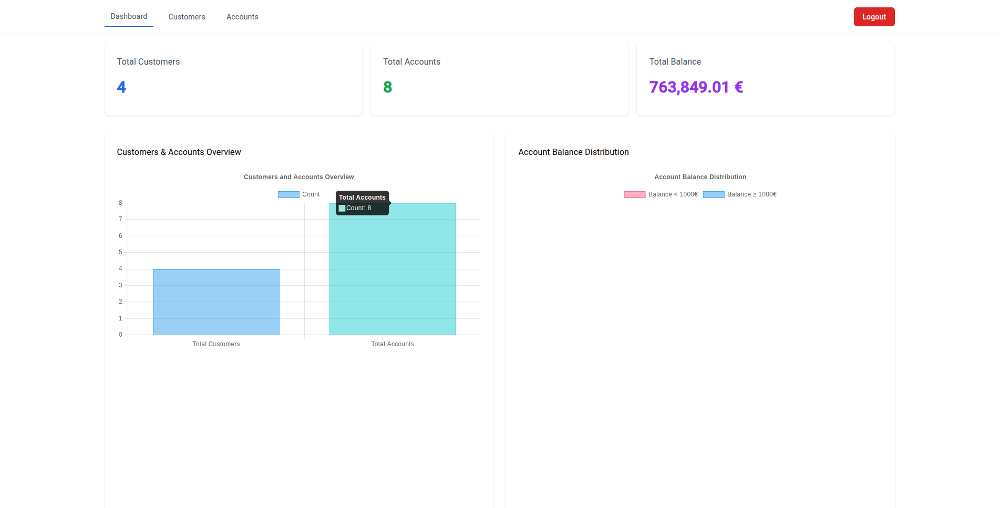
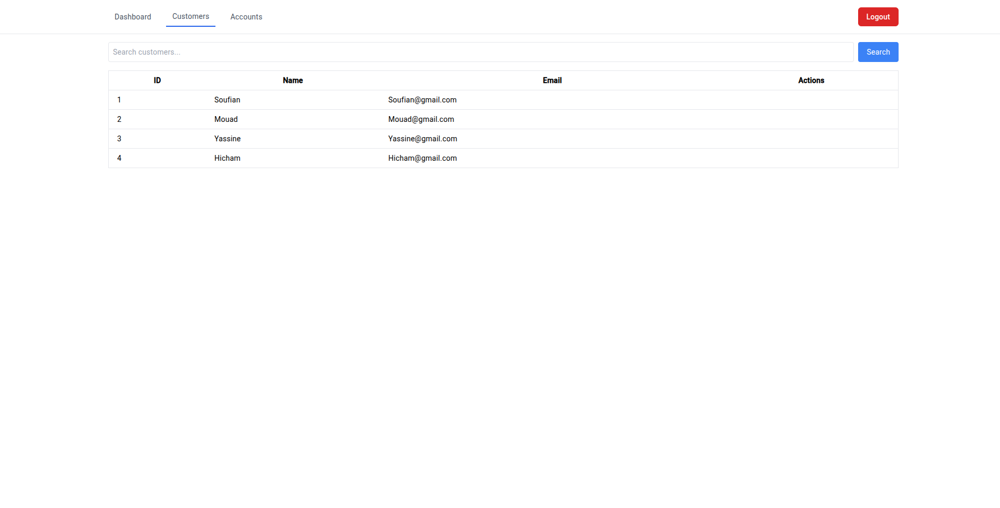
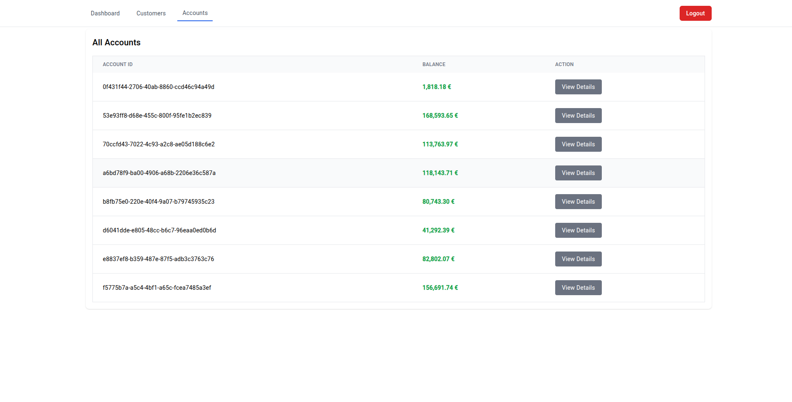

# Application E-Banking - Frontend Angular

## Rapport de Développement Complet - Interface Utilisateur

Cette application constitue la **partie frontend** d'une solution E-Banking complète, développée avec **Angular**. Elle démontre l'utilisation des concepts Angular modernes et des meilleures pratiques de développement pour créer une interface bancaire sécurisée et performante.



### Backend Spring Boot Associé

**Repository Backend** : [E-Banking Backend Spring Boot](https://github.com/MoBourhym/Ebanking-app.git)

- **Technologies** : Spring Boot 3.x, Spring Security, JWT, JPA/Hibernate
- **Base de données** : MySQL
- **Port** : 8085
- **Documentation API** : Swagger UI disponible

---

## Table des Matières

- [Application E-Banking - Frontend Angular](#application-e-banking---frontend-angular)
  - [Rapport de Développement Complet - Interface Utilisateur](#rapport-de-développement-complet---interface-utilisateur)
    - [Backend Spring Boot Associé](#backend-spring-boot-associé)
  - [Table des Matières](#table-des-matières)
  - [Vue d'Ensemble et Objectifs](#vue-densemble-et-objectifs)
    - [Objectifs Principaux](#objectifs-principaux)
    - [Fonctionnalités Bancaires Implémentées](#fonctionnalités-bancaires-implémentées)
    - [Méthodologie de Développement](#méthodologie-de-développement)
  - [🛠️ Technologies et Concepts Angular Utilisés](#️-technologies-et-concepts-angular-utilisés)
    - [1. Standalone Components (Angular 19)](#1-standalone-components-angular-19)
    - [2. Configuration avec app.config.ts](#2-configuration-avec-appconfigts)
    - [3. TypeScript et Type Safety](#3-typescript-et-type-safety)
  - [Système de Routing et Navigation](#système-de-routing-et-navigation)
    - [Configuration des Routes avec Protection](#configuration-des-routes-avec-protection)
    - [AuthGuard - Protection des Routes](#authguard---protection-des-routes)
  - [Authentification et Sécurité](#authentification-et-sécurité)
    - [Service d'Authentification JWT](#service-dauthentification-jwt)
  - [Services et Communication HTTP](#services-et-communication-http)
    - [Service de Gestion des Clients](#service-de-gestion-des-clients)
    - [Service de Gestion des Comptes](#service-de-gestion-des-comptes)
  - [Gestion d'État](#gestion-détat)
    - [Utilisation Avancée de RxJS](#utilisation-avancée-de-rxjs)
    - [Recherche avec Debounce](#recherche-avec-debounce)
  - [Composants et Fonctionnalités](#composants-et-fonctionnalités)
    - [1. Dashboard Component - Tableau de Bord](#1-dashboard-component---tableau-de-bord)
    - [2. Customers Component - Gestion des Clients](#2-customers-component---gestion-des-clients)
    - [3. Add Customer Component - Formulaire d'Ajout](#3-add-customer-component---formulaire-dajout)
    - [4. Header Component - Navigation](#4-header-component---navigation)
  - [Interface Utilisateur et Design](#interface-utilisateur-et-design)
    - [Design System avec Tailwind CSS](#design-system-avec-tailwind-css)
    - [Configuration Tailwind](#configuration-tailwind)
    - [Responsive Design](#responsive-design)
  - [Installation et Configuration](#installation-et-configuration)
    - [Prérequis](#prérequis)
    - [Installation](#installation)
    - [Scripts Disponibles](#scripts-disponibles)
    - [Build pour la Production](#build-pour-la-production)
    - [Configuration Backend](#configuration-backend)
  - [Captures d'Écran de l'Interface](#captures-décran-de-linterface)
    - [1. Page de Connexion](#1-page-de-connexion)
    - [2. Tableau de Bord Principal](#2-tableau-de-bord-principal)
    - [3. Gestion des Clients](#3-gestion-des-clients)
    - [4. Formulaire d'Ajout de Client](#4-formulaire-dajout-de-client)
    - [5. Gestion des Comptes Bancaires](#5-gestion-des-comptes-bancaires)
  - [🚀 Fonctionnalités Avancées Implémentées](#-fonctionnalités-avancées-implémentées)
    - [Contrôle d'Accès Basé sur les Rôles](#contrôle-daccès-basé-sur-les-rôles)
    - [Gestion d'État Réactive](#gestion-détat-réactive)
    - [Optimisations de Performance](#optimisations-de-performance)
    - [Gestion d'Erreurs Centralisée](#gestion-derreurs-centralisée)
  - [🎯 Conclusion](#-conclusion)

---

## Vue d'Ensemble et Objectifs

### Objectifs Principaux

- **Interface Moderne** : Développer une SPA (Single Page Application) responsive et intuitive
- **Sécurité Robuste** : Implémenter l'authentification JWT avec gestion des rôles
- **Performance Optimisée** : Utiliser les dernières fonctionnalités d'Angular 19 pour des performances maximales
- **Expérience Utilisateur** : Créer une interface fluide avec des transitions et animations
- **Maintenabilité** : Architecture modulaire et code réutilisable

### Fonctionnalités Bancaires Implémentées

- **Authentification sécurisée** (Login/Register)
- **Tableau de bord** avec statistiques et graphiques
- **Gestion des clients** (CRUD complet)
- **Gestion des comptes bancaires**
- **Historique des opérations**
- **Contrôle d'accès basé sur les rôles** (ADMIN/USER)

### Méthodologie de Développement

- **Component-Driven Development** : Approche modulaire par composants
- **Reactive Programming** : Utilisation intensive de RxJS
- **Type Safety** : TypeScript strict pour la robustesse
- **Mobile-First** : Design responsive avec Tailwind CSS

## 🛠️ Technologies et Concepts Angular Utilisés

### 1. Standalone Components (Angular 19)

L'application utilise exclusivement les **Standalone Components**, une fonctionnalité majeure d'Angular 19 qui simplifie l'architecture en éliminant le besoin de NgModules.

```typescript
// Exemple : Dashboard Component avec Standalone
@Component({
  selector: 'app-dashboard',
  standalone: true,
  imports: [CommonModule, NgChartsModule],
  templateUrl: './dashboard.component.html'
})
export class DashboardComponent implements OnInit {
  totalCustomers: number = 0;
  totalAccounts: number = 0;
  totalBalance: number = 0;

  constructor(
    private accountsService: AccountsService,
    private customersService: CustomersService
  ) {}

  ngOnInit(): void {
    this.loadDashboardData();
  }
}
```

**Avantages des Standalone Components :**

- **Simplification** : Plus besoin de NgModules complexes
- Performance** : Meilleur tree-shaking et lazy loading
- Maintenabilité** : Code plus lisible et organisé
- Flexibilité** : Import sélectif des dépendances

### 2. Configuration avec app.config.ts

```typescript
// Configuration globale de l'application
export const appConfig: ApplicationConfig = {
  providers: [
    provideZoneChangeDetection({ eventCoalescing: true }),
    provideRouter(routes),
    provideHttpClient(withInterceptors([authInterceptorFn]))
  ]
};

// Intercepteur fonctionnel pour l'authentification JWT
export function authInterceptorFn(
  request: HttpRequest<unknown>,
  next: HttpHandlerFn
): Observable<HttpEvent<unknown>> {
  const authService = inject(AuthService);
  const router = inject(Router);
  const token = authService.getToken();

  const isAuthEndpoint = request.url.includes('/api/v1/auth/');

  if (token && !isAuthEndpoint) {
    const authRequest = request.clone({
      setHeaders: {
        Authorization: `Bearer ${token}`,
      },
    });

    return next(authRequest).pipe(
      catchError((error: HttpErrorResponse) => {
        if (error.status === 401 || error.status === 403) {
          authService.logout();
          router.navigate(['/login']);
        }
        return throwError(() => error);
      })
    );
  }

  return next(request);
}
```

### 3. TypeScript et Type Safety

```typescript
// Modèles de données fortement typés
export interface AuthenticationResponse {
  accessToken: string;
  refreshToken?: string;
}

export interface Customer {
  id: number;
  name: string;
  email: string;
}

export interface AccountDetails {
  id: string;
  balance: number;
  currentPage: number;
  totalPages: number;
  pageSize: number;
  accountOperationDTOS: AccountOperation[];
}

export interface AccountOperation {
  id: number;
  operationDate: Date;
  amount: number;
  type: string;
  description: string;
}

// Type Guards pour la validation
function isValidToken(token: unknown): token is string {
  return typeof token === 'string' && token.length > 0;
}
```

---

## Système de Routing et Navigation

### Configuration des Routes avec Protection

```typescript
// app.routes.ts - Configuration complète du routing
export const routes: Routes = [
  {
    path: 'login',
    component: LoginComponent
  },
  {
    path: 'register',
    component: RegisterComponent
  },
  {
    path: 'dashboard',
    component: DashboardComponent,
    canActivate: [AuthGuard],
    data: { roles: ['ROLE_ADMIN', 'ROLE_USER'] }
  },
  {
    path: 'customers',
    component: CustomersComponent,
    canActivate: [AuthGuard],
    data: { roles: ['ROLE_ADMIN', 'ROLE_USER'] }
  },
  {
    path: 'customers/add',
    component: AddCustomerComponent,
    canActivate: [AuthGuard],
    data: { roles: ['ROLE_ADMIN'] }  // Accès admin uniquement
  },
  {
    path: 'accounts',
    component: AccountsComponent,
    canActivate: [AuthGuard],
    data: { roles: ['ROLE_ADMIN', 'ROLE_USER'] }
  },
  {
    path: '',
    redirectTo: '/dashboard',
    pathMatch: 'full'
  },
  {
    path: '**',
    redirectTo: '/login'  // Route wildcard pour les 404
  }
];
```

### AuthGuard - Protection des Routes

```typescript
// guards/auth.guard.ts - Garde d'authentification avec contrôle des rôles
@Injectable({
  providedIn: 'root',
})
export class AuthGuard implements CanActivate {
  constructor(private authService: AuthService, private router: Router) {}

  canActivate(route: ActivatedRouteSnapshot): boolean {
    // Vérification de l'authentification
    if (!this.authService.isLoggedIn()) {
      this.router.navigate(['/login']);
      return false;
    }

    // Vérification des rôles requis
    const requiredRoles = route.data['roles'] as string[];
    if (requiredRoles && !requiredRoles.some(role => this.authService.hasRole(role))) {
      this.router.navigate(['/login']);
      return false;
    }

    return true;
  }
}
```

**Fonctionnalités du Routing :**

- **Protection par authentification** : Toutes les routes protégées nécessitent une connexion
- **Contrôle d'accès par rôles** : Différents niveaux d'accès (ADMIN/USER)
- **Redirection automatique** : Gestion des routes non autorisées
- **Route wildcard** : Gestion des erreurs 404

---

## Authentification et Sécurité

### Service d'Authentification JWT

```typescript
// services/auth.service.ts - Gestion complète de l'authentification
@Injectable({ providedIn: 'root' })
export class AuthService {
  private apiUrl = environment.backendHost + '/api/v1/auth';
  private jwtHelper = new JwtHelperService();

  constructor(private http: HttpClient) {}

  // Authentification utilisateur
  authenticate(request: AuthenticationRequest): Observable<AuthenticationResponse> {
    return this.http.post<AuthenticationResponse>(`${this.apiUrl}/authenticate`, request);
  }

  // Inscription d'un nouvel utilisateur
  register(request: RegisterRequest): Observable<any> {
    return this.http.post(`${this.apiUrl}/register`, request);
  }

  // Gestion sécurisée des tokens
  saveToken(token: string): void {
    localStorage.setItem('jwt_token', token);
  }

  getToken(): string | null {
    return localStorage.getItem('jwt_token');
  }

  // Vérification de l'état de connexion avec validation JWT
  isLoggedIn(): boolean {
    const token = this.getToken();
    if (!token) return false;

    try {
      // Vérification de la structure du token JWT
      const parts = token.split('.');
      if (parts.length !== 3) {
        this.logout();
        return false;
      }

      // Vérification de l'expiration
      return !this.jwtHelper.isTokenExpired(token);
    } catch (error) {
      console.error('Token validation error:', error);
      this.logout();
      return false;
    }
  }

  // Extraction et validation des rôles utilisateur
  getUserRoles(): string[] {
    const token = this.getToken();
    if (!token) return [];

    try {
      const decodedToken = this.jwtHelper.decodeToken(token);

      // Support de différents formats de payload JWT
      if (decodedToken?.authorities) {
        return Array.isArray(decodedToken.authorities)
          ? decodedToken.authorities
          : [decodedToken.authorities];
      }

      if (decodedToken?.roles) {
        return Array.isArray(decodedToken.roles)
          ? decodedToken.roles
          : [decodedToken.roles];
      }

      return ['ROLE_USER']; // Rôle par défaut
    } catch (error) {
      console.error('Error extracting roles:', error);
      this.logout();
      return [];
    }
  }

  // Vérification des autorisations
  hasRole(role: string): boolean {
    const userRoles = this.getUserRoles();
    return userRoles.includes(role);
  }

  // Déconnexion sécurisée
  logout(): void {
    localStorage.removeItem('jwt_token');
  }
}
```

**Fonctionnalités de Sécurité :**

- **JWT Token Management** : Stockage sécurisé et validation automatique
- **Role-Based Access Control** : Contrôle d'accès granulaire
- **Automatic Token Validation** : Vérification de l'expiration et de la structure
- **Secure Logout** : Nettoyage complet des données d'authentification

---

## Services et Communication HTTP

### Service de Gestion des Clients

```typescript
// services/customers.service.ts - CRUD complet pour les clients
@Injectable({
  providedIn: 'root'
})
export class CustomersService {
  private apiURL = environment.backendHost + '/customers';

  constructor(private http: HttpClient) {}

  // Récupérer tous les clients
  public getAllCustomers(): Observable<Customer[]> {
    return this.http.get<Customer[]>(this.apiURL).pipe(
      catchError(this.handleError)
    );
  }

  // Recherche de clients par mot-clé
  public searchCustomers(keyword: string): Observable<Customer[]> {
    return this.http.get<Customer[]>(`${this.apiURL}/search?keyword=${keyword}`);
  }

  // Créer un nouveau client
  public saveCustomer(customer: Customer): Observable<Customer> {
    return this.http.post<Customer>(this.apiURL, customer);
  }

  // Supprimer un client
  public deleteCustomer(id: number): Observable<void> {
    return this.http.delete<void>(`${this.apiURL}/${id}`);
  }

  // Récupérer un client par ID
  public getCustomer(id: number): Observable<Customer> {
    return this.http.get<Customer>(`${this.apiURL}/${id}`);
  }

  // Mettre à jour un client
  public updateCustomer(customer: Customer): Observable<Customer> {
    return this.http.put<Customer>(`${this.apiURL}/${customer.id}`, customer);
  }

  // Gestion centralisée des erreurs
  private handleError(error: HttpErrorResponse): Observable<never> {
    console.error('An error occurred:', error);
    return throwError(() => new Error('Something went wrong; please try again later.'));
  }
}
```

### Service de Gestion des Comptes

```typescript
// services/accounts.service.ts - Opérations bancaires
@Injectable({
  providedIn: 'root'
})
export class AccountsService {
  private apiURL = environment.backendHost + '/accounts';

  constructor(private http: HttpClient) {}

  // Récupérer tous les comptes
  public getAllAccounts(): Observable<AccountDetails[]> {
    return this.http.get<AccountDetails[]>(this.apiURL);
  }

  // Récupérer les détails d'un compte avec pagination
  public getAccount(accountId: string, page: number, size: number): Observable<AccountDetails> {
    return this.http.get<AccountDetails>(`${this.apiURL}/${accountId}/pageOperations?page=${page}&size=${size}`);
  }

  // Récupérer l'historique complet d'un compte
  public getAccountHistory(accountId: string): Observable<any> {
    return this.http.get<any>(`${this.apiURL}/${accountId}/operations`);
  }

  // Débiter un compte
  public debit(accountId: string, amount: number, description: string): Observable<any> {
    const data = { accountId, amount, description };
    return this.http.post(`${this.apiURL}/debit`, data);
  }

  // Créditer un compte
  public credit(accountId: string, amount: number, description: string): Observable<any> {
    const data = { accountId, amount, description };
    return this.http.post(`${this.apiURL}/credit`, data);
  }

  // Virement entre comptes
  public transfer(accountSource: string, accountDestination: string, amount: number, description: string): Observable<any> {
    const data = { accountSource, accountDestination, amount, description };
    return this.http.post(`${this.apiURL}/transfer`, data);
  }
}
```

---

## Gestion d'État

### Utilisation Avancée de RxJS

```typescript
// dashboard.component.ts - Programmation réactive avec RxJS
export class DashboardComponent implements OnInit {

  // Chargement parallèle de données avec forkJoin
  loadDashboardData(): void {
    forkJoin({
      customers: this.customersService.getAllCustomers(),
      accounts: this.accountsService.getAllAccounts()
    }).pipe(
      // Transformation des données
      map(data => ({
        ...data,
        totalBalance: data.accounts.reduce((sum, acc) => sum + acc.balance, 0),
        lowBalanceAccounts: data.accounts.filter(acc => acc.balance < 1000).length,
        highBalanceAccounts: data.accounts.filter(acc => acc.balance >= 1000).length
      })),
      // Gestion des erreurs
      catchError(error => {
        console.error('Error loading dashboard data:', error);
        return of({
          customers: [],
          accounts: [],
          totalBalance: 0,
          lowBalanceAccounts: 0,
          highBalanceAccounts: 0
        });
      }),
      // Finalisation
      finalize(() => {
        console.log('Dashboard data loading completed');
      })
    ).subscribe({
      next: (data) => {
        // Mise à jour des statistiques
        this.totalCustomers = data.customers.length;
        this.totalAccounts = data.accounts.length;
        this.totalBalance = data.totalBalance;

        // Mise à jour des graphiques
        this.updateCharts(data);
      },
      error: (error) => {
        console.error('Subscription error:', error);
      }
    });
  }
}
```

### Recherche avec Debounce

```typescript
// customers.component.ts - Recherche optimisée
export class CustomersComponent implements OnInit {
  searchCustomers$ = new Subject<string>();

  ngOnInit(): void {
    // Configuration de la recherche avec debounce
    this.searchCustomers$.pipe(
      debounceTime(300),           // Attendre 300ms après la dernière frappe
      distinctUntilChanged(),      // Ignorer les valeurs identiques
      switchMap(keyword =>
        keyword.trim()
          ? this.customersService.searchCustomers(keyword)
          : this.customersService.getAllCustomers()
      )
    ).subscribe(customers => {
      this.customers = customers;
    });
  }

  // Méthode appelée lors de la saisie
  onSearchKeyword(keyword: string): void {
    this.searchCustomers$.next(keyword);
  }
}
```

**Concepts RxJS Utilisés :**

- **forkJoin** : Appels API parallèles
- **map, catchError, finalize** : Transformation et gestion d'erreurs
- **debounceTime, distinctUntilChanged** : Optimisation des recherches
- **switchMap** : Annulation des requêtes précédentes
- **Subject** : Communication entre composants

---

## Composants et Fonctionnalités

### 1. Dashboard Component - Tableau de Bord

```typescript
// dashboard.component.ts - Composant principal avec graphiques
@Component({
  selector: 'app-dashboard',
  standalone: true,
  imports: [CommonModule, NgChartsModule],
  templateUrl: './dashboard.component.html'
})
export class DashboardComponent implements OnInit {
  @ViewChild(BaseChartDirective) chart?: BaseChartDirective;

  // Propriétés pour les statistiques
  totalCustomers: number = 0;
  totalAccounts: number = 0;
  totalBalance: number = 0;

  // Configuration des graphiques Chart.js
  public barChartData: ChartConfiguration<'bar'>['data'] = {
    labels: ['Total Customers', 'Total Accounts'],
    datasets: [{
      data: [0, 0],
      label: 'Count',
      backgroundColor: [
        'rgba(54, 162, 235, 0.5)',
        'rgba(75, 192, 192, 0.5)'
      ],
      borderColor: [
        'rgba(54, 162, 235, 1)',
        'rgba(75, 192, 192, 1)'
      ],
      borderWidth: 1
    }]
  };

  public barChartOptions: ChartConfiguration<'bar'>['options'] = {
    responsive: true,
    maintainAspectRatio: false,
    scales: {
      y: {
        beginAtZero: true,
        ticks: { stepSize: 1 }
      }
    },
    plugins: {
      legend: { display: true, position: 'top' },
      title: { display: true, text: 'Banking Overview' }
    }
  };

  // Graphique en camembert pour la distribution des soldes
  public pieChartData: ChartConfiguration<'pie'>['data'] = {
    labels: ['Balance < 1000€', 'Balance ≥ 1000€'],
    datasets: [{
      data: [0, 0],
      backgroundColor: [
        'rgba(255, 99, 132, 0.5)',
        'rgba(54, 162, 235, 0.5)'
      ]
    }]
  };

  // Mise à jour des graphiques
  updateCharts(data: any): void {
    this.barChartData.datasets[0].data = [
      this.totalCustomers,
      this.totalAccounts
    ];

    const lowBalanceAccounts = data.accounts.filter(acc => acc.balance < 1000).length;
    const highBalanceAccounts = data.accounts.filter(acc => acc.balance >= 1000).length;

    this.pieChartData.datasets[0].data = [lowBalanceAccounts, highBalanceAccounts];
    this.chart?.update();
  }
}
```

### 2. Customers Component - Gestion des Clients

```typescript
// customers.component.ts - CRUD complet avec recherche
@Component({
  selector: 'app-customers',
  standalone: true,
  imports: [CommonModule, FormsModule, RouterLink],
  templateUrl: './customers.component.html'
})
export class CustomersComponent implements OnInit {
  customers: Customer[] = [];
  searchKeyword: string = '';
  errorMessage: string = '';
  searchCustomers$ = new Subject<string>();

  constructor(
    private customersService: CustomersService,
    public authService: AuthService
  ) {}

  ngOnInit(): void {
    this.loadCustomers();
    this.setupSearch();
  }

  // Configuration de la recherche avec debounce
  setupSearch(): void {
    this.searchCustomers$.pipe(
      debounceTime(300),
      distinctUntilChanged(),
      switchMap(keyword =>
        keyword.trim()
          ? this.customersService.searchCustomers(keyword)
          : this.customersService.getAllCustomers()
      )
    ).subscribe({
      next: (customers) => {
        this.customers = customers;
      },
      error: (error) => {
        this.errorMessage = 'Error searching customers';
        console.error('Error:', error);
      }
    });
  }

  // Chargement des clients
  loadCustomers(): void {
    this.customersService.getAllCustomers().subscribe({
      next: (customers) => {
        this.customers = customers;
      },
      error: (error) => {
        this.errorMessage = 'Error loading customers';
        console.error('Error:', error);
      }
    });
  }

  // Recherche de clients
  onSearchKeyword(): void {
    this.searchCustomers$.next(this.searchKeyword);
  }

  // Suppression d'un client (admin uniquement)
  deleteCustomer(customer: Customer): void {
    if (confirm(`Are you sure you want to delete ${customer.name}?`)) {
      this.customersService.deleteCustomer(customer.id).subscribe({
        next: () => {
          this.loadCustomers(); // Recharger la liste
        },
        error: (error) => {
          this.errorMessage = 'Error deleting customer';
          console.error('Error:', error);
        }
      });
    }
  }
}
```

### 3. Add Customer Component - Formulaire d'Ajout

```typescript
// add-customer.component.ts - Formulaire avec validation
@Component({
  selector: 'app-add-customer',
  standalone: true,
  imports: [CommonModule, FormsModule],
  templateUrl: './add-customer.component.html'
})
export class AddCustomerComponent {
  customer: Customer = {
    id: 0,
    name: '',
    email: ''
  };

  isLoading = false;
  errorMessage = '';

  constructor(
    private customersService: CustomersService,
    private router: Router
  ) {}

  // Soumission du formulaire
  onSubmit(): void {
    if (this.customer.name && this.customer.email) {
      this.isLoading = true;
      this.errorMessage = '';

      this.customersService.saveCustomer(this.customer).subscribe({
        next: () => {
          this.isLoading = false;
          this.router.navigate(['/customers']);
        },
        error: (error) => {
          this.isLoading = false;
          this.errorMessage = 'Failed to add customer. Please try again.';
          console.error('Error adding customer:', error);
        }
      });
    }
  }

  // Annulation
  cancel(): void {
    this.router.navigate(['/customers']);
  }
}
```

### 4. Header Component - Navigation

```typescript
// header.component.ts - Navigation avec authentification
@Component({
  selector: 'app-header',
  standalone: true,
  imports: [CommonModule, RouterLink],
  templateUrl: './header.component.html'
})
export class HeaderComponent {
  constructor(public authService: AuthService, private router: Router) {}

  // Déconnexion
  logout(): void {
    this.authService.logout();
    this.router.navigate(['/login']);
  }

  // Vérification des rôles pour l'affichage conditionnel
  isAdmin(): boolean {
    return this.authService.hasRole('ROLE_ADMIN');
  }
}
```

---

## Interface Utilisateur et Design

### Design System avec Tailwind CSS

```css
/* styles.css - Configuration globale */
@tailwind base;
@tailwind components;
@tailwind utilities;

/* Classes utilitaires personnalisées */
.btn-primary {
  @apply bg-blue-500 text-white py-2 px-4 rounded-md hover:bg-blue-600
         transition-colors duration-200 disabled:opacity-50;
}

.btn-secondary {
  @apply bg-gray-500 text-white py-2 px-4 rounded-md hover:bg-gray-600;
}

.btn-danger {
  @apply bg-red-500 text-white py-2 px-4 rounded-md hover:bg-red-600;
}

.card {
  @apply bg-white rounded-lg shadow-md p-6 border border-gray-200;
}

.form-input {
  @apply w-full px-3 py-2 border border-gray-300 rounded-md
         focus:outline-none focus:ring-2 focus:ring-blue-500;
}

.table-header {
  @apply bg-gray-50 px-6 py-3 text-left text-xs font-medium
         text-gray-500 uppercase tracking-wider;
}
```

### Configuration Tailwind

```javascript
// tailwind.config.js
/** @type {import('tailwindcss').Config} */
module.exports = {
  content: [
    "./src/**/*.{html,ts}",
  ],
  theme: {
    extend: {
      colors: {
        primary: {
          50: '#eff6ff',
          500: '#3b82f6',
          600: '#2563eb',
          700: '#1d4ed8',
        }
      }
    },
  },
  plugins: [],
}
```

### Responsive Design

L'application utilise un design **mobile-first** avec des breakpoints Tailwind :

- **sm:** 640px et plus (tablettes)
- **md:** 768px et plus (tablettes larges)
- **lg:** 1024px et plus (ordinateurs portables)
- **xl:** 1280px et plus (écrans larges)

```html
<!-- Exemple de design responsive -->
<div class="grid grid-cols-1 md:grid-cols-2 lg:grid-cols-3 gap-6">
  <div class="card">
    <h3 class="text-lg font-semibold mb-2">Total Customers</h3>
    <p class="text-3xl font-bold text-blue-600">{{ totalCustomers }}</p>
  </div>
</div>
```

---

## Installation et Configuration

### Prérequis

- **Node.js** 18+ et npm
- **Angular CLI** 19+
- **Backend Spring Boot** en fonctionnement sur le port 8085

### Installation

```bash
# 1. Cloner le repository
git clone https://github.com/votre-username/ebanking-frontend.git
cd ebanking-frontend

# 2. Installer les dépendances
npm install

# 3. Configuration de l'environnement
# Modifier environment/environment.ts avec l'URL de votre backend
export const environment = {
  production: false,
  backendHost: "http://localhost:8085"
};

# 4. Démarrer le serveur de développement
npm start
# ou
ng serve

# L'application sera accessible sur http://localhost:4200
```

### Scripts Disponibles

```json
{
  "scripts": {
    "ng": "ng",
    "start": "ng serve",
    "build": "ng build",
    "watch": "ng build --watch --configuration development",
    "test": "ng test",
    "serve:ssr": "node dist/ebanking-ui/server/server.mjs"
  }
}
```

### Build pour la Production

```bash
# Build optimisé pour la production
npm run build

# Les fichiers seront générés dans dist/ebanking-ui/
```

### Configuration Backend

Assurez-vous que votre backend Spring Boot est configuré avec :

```yaml
# application.yml
server:
  port: 8085

spring:
  datasource:
    url: jdbc:mysql://localhost:3306/ebanking_db
    username: root
    password: your_password

# Configuration CORS
cors:
  allowed-origins: http://localhost:4200
  allowed-methods: GET,POST,PUT,DELETE,OPTIONS
  allowed-headers: "*"
```

---

## Captures d'Écran de l'Interface

### 1. Page de Connexion

*[ESPACE RÉSERVÉ POUR CAPTURE D'ÉCRAN]*

**Fonctionnalités :**

- Formulaire de connexion sécurisé
- Validation en temps réel
- Messages d'erreur explicites
- Lien vers la page d'inscription
- Design responsive

### 2. Tableau de Bord Principal



**Fonctionnalités :**

- Statistiques en temps réel
- Graphiques interactifs (Chart.js)
- Cards avec métriques importantes
- Navigation intuitive
- Design moderne et professionnel

### 3. Gestion des Clients



**Fonctionnalités :**

- Liste complète des clients
- Barre de recherche avec debounce
- Boutons d'action pour les administrateurs
- Pagination et tri
- Actions CRUD complètes

### 4. Formulaire d'Ajout de Client

*[ESPACE RÉSERVÉ POUR CAPTURE D'ÉCRAN]*

**Fonctionnalités :**

- Formulaire avec validation
- Messages d'erreur en temps réel
- Boutons d'action (Ajouter/Annuler)
- Design cohérent avec le reste de l'application
- Feedback utilisateur (loading states)

### 5. Gestion des Comptes Bancaires



**Fonctionnalités :**

- Visualisation des comptes
- Historique des opérations
- Pagination des transactions
- Filtres et recherche
- Opérations bancaires (débit/crédit/virement)


---

## 🚀 Fonctionnalités Avancées Implémentées

### Contrôle d'Accès Basé sur les Rôles

```typescript
// Exemple d'utilisation dans les templates
<button
  *ngIf="authService.hasRole('ROLE_ADMIN')"
  (click)="deleteCustomer(customer)"
  class="btn-danger">
  Delete
</button>
```

### Gestion d'État Réactive

```typescript
// Utilisation de BehaviorSubject pour l'état global
private customersSubject = new BehaviorSubject<Customer[]>([]);
public customers$ = this.customersSubject.asObservable();
```

### Optimisations de Performance

- **OnPush Change Detection** : Optimisation des performances
- **TrackBy Functions** : Optimisation des listes
- **Lazy Loading** : Chargement à la demande
- **HTTP Caching** : Mise en cache des requêtes

### Gestion d'Erreurs Centralisée

```typescript
// Intercepteur global pour la gestion d'erreurs
export function errorInterceptor(req: HttpRequest<any>, next: HttpHandlerFn): Observable<HttpEvent<any>> {
  return next(req).pipe(
    catchError((error: HttpErrorResponse) => {
      // Gestion centralisée des erreurs
      console.error('HTTP Error:', error);
      return throwError(() => error);
    })
  );
}
```

## Conclusion

Cette application E-Banking démontre une maîtrise complète des concepts Angular modernes et des meilleures pratiques de développement frontend. Elle offre une solution robuste, sécurisée et performante pour la gestion bancaire en ligne.
